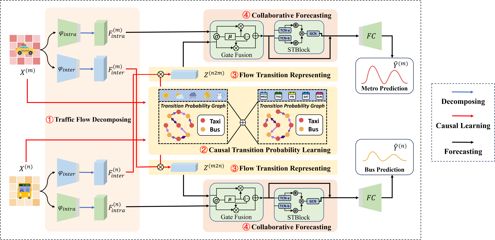
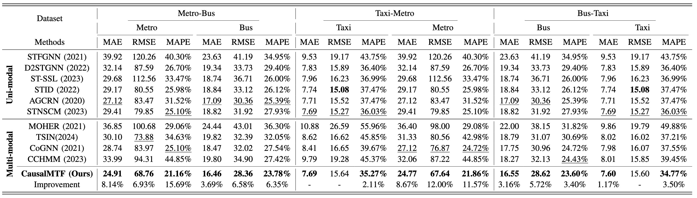

# Causal-Aware Flow Transitions Learning for Enhanced Multi-Modal Traffic Flow Forecasting (CausalMTF)


## Abstract
<p align="center">


</p>

Multi-modal traffic forecasting (MTF) is an essential task to coordinate various public transports by capturing interaction across different traffic modalities. To model the inter-modal interactions, most existing methods rely on calculating similarities between multi-modal traffic flow; however, these approaches overlook the causal effect of biased environmental factors on traffic, tending to yield misleading multi-modal relationships. To address this, we propose a causal framework that adaptively estimates flow transitions between transports across diverse environmental states, offering clearer and more interpretable insights into MTF. Specifically, we first construct a structural causal model to quantify environment-related flow transitions, which perform causal intervention in traffic interactions via front-door adjustment to eliminate inherent biases in traffic data. Based on this causal treatment, we then elaborate a CausalMTF network to capture the dynamic causation between environmental factors and multi-modal traffic, while learning spatio-temporal dependencies for prediction. Experimental results on real-world datasets demonstrate the effectiveness, generalizability, and interpretability of our CausalMTF on MTF.

## Requirements:
- python 3.7.16
- torch == 1.13.1
- numpy == 1.21.6

## Datasets
The "data" folder provides a Metro-Bus dataset for testing

The remaining datasets can be downloaded from [UCTB](https://github.com/uctb/Urban-Dataset/tree/main)

## Train:
You can train our CausalMTF by following the steps bellow.

 - Run with "python train.py" for UCTB dataset, or "python train.py --dataset nyc_mb --device 0" for Metro-Bus dataset using GPU device 0

   ```
   python train.py
   ```

   ```
   python train.py --dataset nyc_mb --device 0
   ```

 - Check the output results. Models are saved to "experiments" folder for further use.

